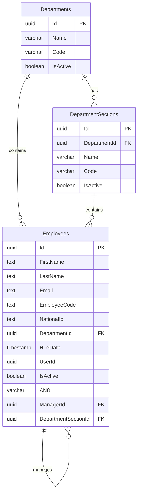

# Database Schema

This document describes the database schema for the Leave Request system, based on the provided entity relationship diagram.

## Entity Relationship Diagram

## Tables Reference

### Departments
Stores the main organizational departments.

| Column | Type | Nullable | Description |
| :--- | :--- | :--- | :--- |
| `Id` | `uuid` | No | Primary Key |
| `Name` | `varchar(128)` | No | Name of the department |
| `Code` | `varchar(32)` | No | Unique code for the department |
| `IsActive` | `boolean` | No | Active status |

### DepartmentSections
Sub-divisions within a department.

| Column | Type | Nullable | Description |
| :--- | :--- | :--- | :--- |
| `Id` | `uuid` | No | Primary Key |
| `DepartmentId` | `uuid` | No | Foreign Key to `Departments` |
| `Name` | `varchar(128)` | No | Name of the section |
| `Code` | `varchar(32)` | No | Unique code for the section |
| `IsActive` | `boolean` | No | Active status |

### Employees
Stores employee information and their organizational associations.

| Column | Type | Nullable | Description |
| :--- | :--- | :--- | :--- |
| `Id` | `uuid` | No | Primary Key |
| `FirstName` | `text` | No | Employee first name |
| `LastName` | `text` | No | Employee last name |
| `Email` | `text` | No | Work email address |
| `EmployeeCode` | `text` | No | Unique internal identification code |
| `NationalId` | `text` | No | National identification number |
| `DepartmentId` | `uuid` | No | Foreign Key to `Departments` |
| `HireDate` | `timestamp` | No | Date of hiring |
| `UserId` | `uuid` | Yes | Associated system user ID |
| `IsActive` | `boolean` | No | Employment status |
| `AN8` | `varchar(20)` | Yes | External system identifier (e.g. JDE) |
| `ManagerId` | `uuid` | Yes | Self-reference to `Employees` for reporting structure |
| `DepartmentSectionId` | `uuid` | Yes | Foreign Key to `DepartmentSections` |
